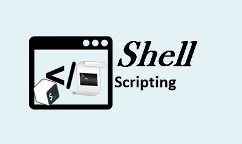

# Shell-scripting

Shell script is a text file that contains a list of executable commands. Shell scripting is primarily used to automate repetitive system tasks, such as backing up files, monitoring system resources, and managing user accounts.The shell is a command-line interpreter that provides a command-line user interface to the operating system. Common Unix and Unix-like operating systems include shells such as Bash, sh, and others.

## Shell Scripting Syntax Elements
## 1 Variables
variables are used to store and manipulate data. Variable names are case-sensitive. in writing a variable, note that there must be no spaces around the "=" sign: VAR=value and its wise to avoid using special characters or reserved words when writing variables

### Assigning a value to a variable and retrieving a value from variable

## 2 Control flow

Control flow refers to the order in which statements are executed in a program. In shell scripting, control flow is managed through conditional statements and loops
one way to control flow is the use of if-else to execute script.  The if-else statement is used to make decisions based on conditions. Exaple is shown in this script

make the script execuable with chmode +x
The chmod +x command is used in Unix-like operating systems to add execute permission to a file. The chmod command stands for "change mode," and +x is an argument indicating that the execute permission should be added.

Execute the file with ./
The ./ (dot slash) notation is used in Unix-like operating systems to specify the current directory. When you use ./ in conjunction with a command, it tells the system to look for the executable file in the current directory.

## 3 Command substitution
Command substitution is a feature in Unix-like operating systems that allows you to use the output of a command as an argument to another command or as part of a larger command. There are two common syntaxes for command substitution:
Backticks:
Enclose the command within backticks (`) to perform command substitution. and 
Dollar Parentheses:
Enclose the command within $() to perform command substitution.

## 4 Input and output
In Bash scripting, input and output are means of interacting with the user, reading data from external sources, and displaying information.

[ouput text to terminal](./img/8%20input%20output..png)

## 5 Functions
Functions are blocks of reusable code that can be defined once and called multiple times within a script. They help in organizing and modularizing code. Functions can be defined using the function keyword or by decalring the function name, followed by parentheses. 

#!/bin/bash is the shebang line for a Bash script. The shebang line, often seen at the beginning of a script, specifies the interpreter to be used for executing the script. #!/bin/bash indicates that the script should be interpreted and executed using the Bash shell.

execute the fuction

Iterating through a list using a for loop

Creat a text file iterate.sh and edit with vim

Compose script

Execute script

## First Shell Script

### Steps in writting a shell script
create and open a folder named shell-scripting

creat a text file for the script in shell-scripting

Use a text editor,nano, vim, to write script. 

Start script with a shebang line to specify interpreter

Compose the main body of script. Include commands, logic, and any other functionality needed

Explain complex sections of code with comments, starting with the # sign. the # sign indicates the line is a comment, not a command

Save script. .sh extention is adviced for easy identification of script

Make the script executable by running the chmod +x script-name command

Execute script by running ./script-name

[exec.](./img/16%20script2%20exec.png)

In the case of debugging, add debugging statements or use the set -x option to trace script execution.

### Directory manipulation
Bash provides various commands for directory manipulation and navigation as used in navigating-linux-filesystem.sh

creat a text file, navigating-linux-filesystem.sh  

Use a text editor, vim to write script. 

Make the script executable by running the chmod +x script-name command

Execute script by running  ./navigating-linux-filesystem.sh

### File Operation and Sorting
this includes reading from a file, writing to a file, sorting lines in a file, duplicate sorting and removal,reverserse order sorting, numerical sorting, selecting a range of line and more

creat a text file, sorting.sh
edit sorting.sh with vim

Start script with a shebang line to specify interpreter

Compose the main body of script. Include commands, logic, and any other functionality needed

Explain complex sections of code with comments, starting with the # sign. the # sign indicates the line is a comment, not a command

Make the script executable by running the chmod +x sorting.sh command

Execute script by running  ./sorting.sh

### Working with numbers and Calculations
there are built-in arithmetic operations that aids working with numbers. In bash scripting, various calculations can be performed

creat a text file, calculation.sh
edit calculation.sh with vim

Start script with a shebang line to specify interpreter

Compose the main body of script. Include commands, logic, and any other functionality needed

Explain complex sections of code with comments, starting with the # sign. the # sign indicates the line is a comment, not a command

Make the script executable by running
chmod +xcalculation.sh

Execute script by running 
./calculation.sh

### File Backup and Timestamping

creat a text file, backup.sh
edit backup.sh with vim

Start script with a shebang line to specify interpreter

Compose the main body of script. Include commands, logic, and any other functionality needed

Explain complex sections of code with comments, starting with the # sign. the # sign indicates the line is a comment, not a command

[backup.sh](./img/27.1%20script%206.png)

Make the script executable by running
chmod +x backup.sh

Execute script by running ./backup.sh

